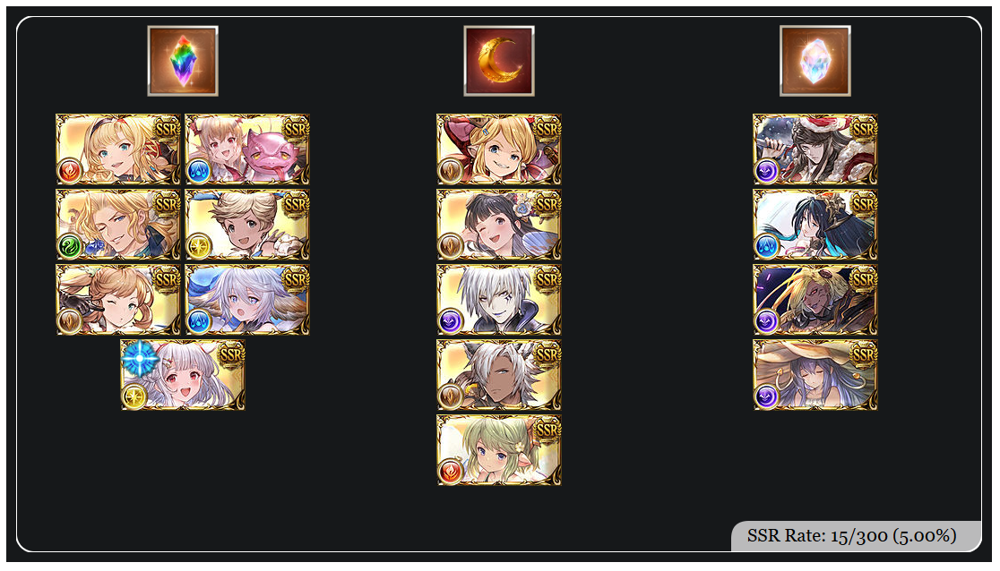

# GBF Spark Tracker

This is a Chromium plugin for Granblue Fantasy that keeps track of what SSRs you get while rolling, including scamchas, and what you spark.

A spark image can be generated at any time, as long as an SSR has been rolled. The image will open in a new tab.

Sample spark image:

# Installation
1. Download this repository as a ZIP file and extract it
2. Go to Manage Extensions in your browser
3. Turn on Developer Mode
4. Click Load Unpacked and select the extracted folder

# Usage
This plugin automatically tracks rolls.

Press Reset Spark to wipe data. Press Generate Spark Image to generate an image.